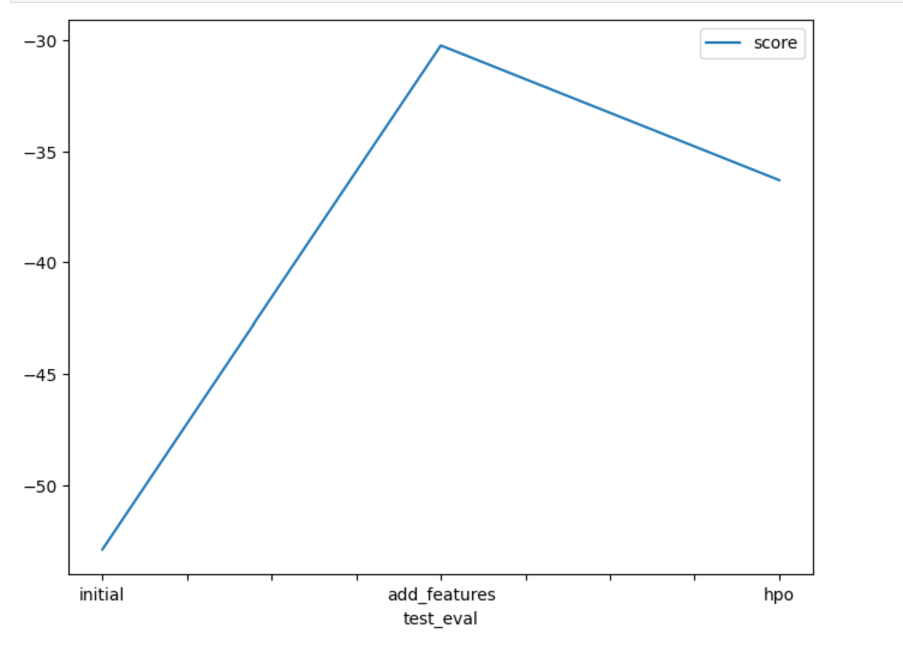

# Report: Predict Bike Sharing Demand with AutoGluon Solution
#### Samuel H.Mariam

## Initial Training
### What did you realize when you tried to submit your predictions? What changes were needed to the output of the predictor to submit your results?
The predicted values should be non-negative. 

### What was the top ranked model that performed?
 WeightedEnsemble_L3

## Exploratory data analysis and feature creation
### What did the exploratory analysis find and how did you add additional features?
The EDA highlighted the following points:
1. The 'season' and 'weather' features are categorical. 
2. The 'datatime' should be expanded to add features so that it can play a role as a relevant feature.
3. The distribution of the numerical features were highlighted as well.

### How much better did your model preform after adding additional features and why do you think that is?
With the addition of the feature values from the 'datetime' column, the public score improved from 1.8 to 0.65.

## Hyper parameter tuning
### How much better did your model preform after trying different hyper parameters?
With the addition of hyperparameter tuning values, the score improved from 0.65 to 0.46

### If you were given more time with this dataset, where do you think you would spend more time?
Given addition time and compute resources, time would be spend on testing different of hyperparameters. 

### Create a table with the models you ran, the hyperparameters modified, and the kaggle score.

### Create a line plot showing the top model score for the three (or more) training runs during the project.

### Create a line plot showing the top kaggle score for the three (or more) prediction submissions during the project.

